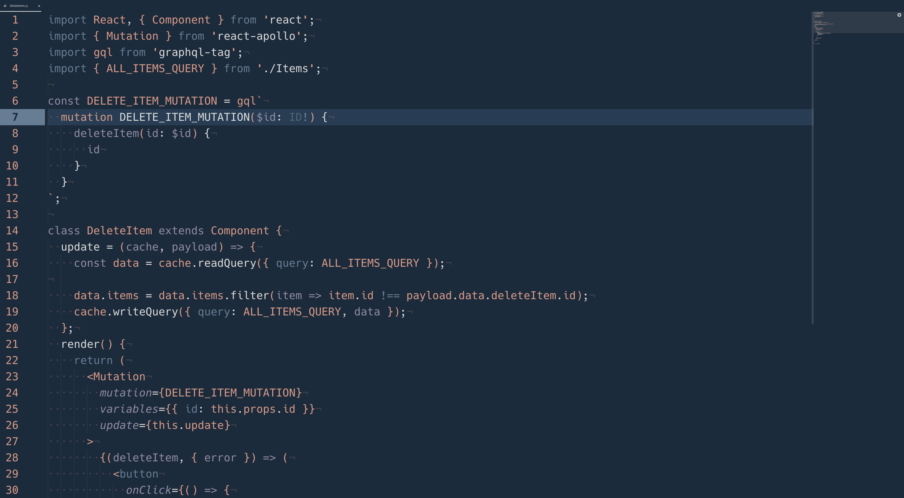

# 蛍 Syntax Theme

Hotaru (firefly) is a dark theme that, like my other themes, is based off a keycap set called [GMK Firefly](https://geekhack.org/index.php?topic=101665.0).

This theme is mainly optimized for JS but looks great (in my opinion) with other languages.

# Installation

On your console:

```
apm install hotaru-syntax
```

or install via Atom's settings install tab.

Works great when paired with a dynamic UI theme like [Kecleon UI](https://github.com/arturoalviar/atom-kecleon-ui).

```
apm install kecleon-ui
```

# Screenshots


